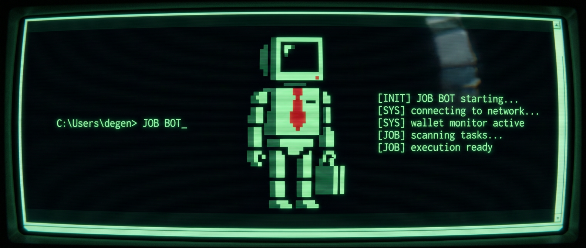

# JOB BOT

<p align="center">
  
</p>

<p align="center">
  <strong>An autonomous 9-to-5 replacement agent built so you can focus on degen'ing.</strong>
</p>

<p align="center">
  
  
  
  
</p>

<p align="center">
  
  
  
  
</p>

---

## What is JOB BOT?

Most jobs are not mysterious.

They are the same stack of repetitive digital tasks performed every day:

- replying to emails
- filling in spreadsheets
- writing weekly reports
- maintaining task boards
- summarizing calls
- pushing status updates nobody wants to write

**JOB BOT** is an autonomous corporate workload agent that handles that layer for you.

It clocks in.  
It processes the routine.  
It keeps the machine moving.

You focus on the real work:

**sleeping at your desk or degen'ing.**

---

## Core Premise

JOB BOT is designed around a simple belief:

> The majority of modern work is structured, repetitive, digital, and automatable.

The average office workflow is not a sacred ritual. It is a loop.

A loop of inbox triage, spreadsheet updates, recurring reports, follow-ups, handoffs, summaries, and check-ins.

JOB BOT exists to absorb that loop.

It does not claim to replace human judgment in every context. It claims something more believable and more useful:

**it takes ownership of the repetitive operational layer of knowledge work.**

That means:

- ingesting task queues
- monitoring inbound communication
- drafting and sending routine responses
- generating status updates
- assembling reports from structured inputs
- updating spreadsheets and trackers
- recording work logs
- closing out recurring work cycles

---

## Why it exists

Because the future of work is not more dashboards.

It is delegation.

And if digital work can be reduced to patterns, then those patterns can be executed by an agent.

JOB BOT is that agent.

It is a worker process disguised as an employee.

---

## Features

### 1. Inbox Handling

JOB BOT monitors assigned inboxes, classifies messages, drafts replies, escalates only when necessary, and clears low-value repetition from your day.

Examples:

- acknowledging routine requests
- replying with pre-approved templates
- sorting action items
- grouping emails by urgency
- flagging human-required responses

### 2. Report Generation

JOB BOT builds daily, weekly, and recurring reports from structured inputs.

Examples:

- daily performance summaries
- weekly KPI reports
- client status updates
- internal work summaries
- end-of-shift logs

### 3. Spreadsheet Automation

JOB BOT updates spreadsheets and trackers without requiring human babysitting.

Examples:

- appending records
- updating row states
- reconciling values
- logging completions
- maintaining work dashboards

### 4. Shift Scheduling

JOB BOT can run according to a defined workday.

Examples:

- clock in at shift start
- process recurring jobs
- run inbox sweeps every N minutes
- produce an end-of-day summary
- clock out cleanly

### 5. Task Queue Execution

JOB BOT continuously consumes structured work items and executes them against configured workflows.

Examples:

- task board updates
- recurring admin routines
- document processing
- operational checklists
- meeting summary distribution

### 6. Logging and Audit Trail

Every action is logged in a way that makes the agent's work visible, reviewable, and attributable.

Examples:

- task start/finish timestamps
- generated outputs
- decisions taken
- skipped actions
- escalation reasons

---

## How it works

At a high level, JOB BOT operates in five phases.

### 1. Clock In

The runtime starts a work session and loads configured modules.

### 2. Observe

The monitor layer watches inboxes, tasks, schedules, and recurring work queues.

### 3. Decide

The agent determines which work can be executed autonomously and which work must be escalated.

### 4. Execute

Task modules handle the actual work:

- email
- reports
- spreadsheets
- meetings
- task status updates

### 5. Clock Out

The agent writes logs, summarizes the shift, and exits cleanly.

---

## Repository Structure

```text
job-bot/
├── src/
│   ├── agent/
│   │   ├── jobbot.ts
│   │   └── runtime.ts
│   │
│   ├── tasks/
│   │   ├── emails.ts
│   │   ├── reports.ts
│   │   ├── spreadsheets.ts
│   │   └── meetings.ts
│   │
│   ├── scheduler/
│   │   ├── clock.ts
│   │   └── shift.ts
│   │
│   ├── monitor/
│   │   ├── inbox-monitor.ts
│   │   └── workload.ts
│   │
│   ├── logs/
│   │   └── workday.log
│   │
│   └── utils/
│       ├── logger.ts
│       ├── config.ts
│       └── formatting.ts
│
├── scripts/
│   └── start-jobbot.ts
│
├── README.md
├── package.json
├── tsconfig.json
└── .env.example
```

## Runtime Architecture

### src/agent/jobbot.ts

The primary orchestration layer.

Responsibilities:

- load configuration
- initialize modules
- start and end shifts
- route work to task handlers
- record agent actions
- handle escalation rules

### src/agent/runtime.ts

The execution harness for the agent.

Responsibilities:

- boot sequence
- dependency wiring
- loop control
- error handling
- safe shutdown

### src/tasks/\*

Task executors.

Responsibilities:

- process specific categories of work
- generate outputs
- persist logs
- return structured results to the agent

### src/scheduler/\*

Controls work timing.

Responsibilities:

- shift start
- shift end
- recurring cycles
- task intervals
- workday windows

### src/monitor/\*

Observes the incoming workload.

Responsibilities:

- inbox polling
- queue observation
- workload prioritization
- backlog visibility

### src/utils/\*

Shared foundations.

Responsibilities:

- structured logging
- config loading
- formatting
- validation
- common helpers

## Example Workflow

```text
08:59:58  SHIFT STARTED
09:00:00  inbox monitor online
09:00:03  task queue loaded
09:00:07  spreadsheet worker active
09:00:10  report generator active
09:02:14  7 emails classified
09:05:48  3 spreadsheet tasks completed
09:11:02  weekly status report generated
09:15:22  1 message escalated for human review
17:00:00  shift summary written
17:00:01  CLOCK OUT

## Example Use Cases

### Routine operations assistant
A team wants an agent to process administrative work that follows fixed patterns.

JOB BOT can:
- sort requests
- write basic replies
- update trackers
- produce summaries

### Founder support layer
A solo founder is buried in operational repetition.

JOB BOT can:
- answer routine inbound
- keep dashboards current
- prepare updates
- maintain a visible work log

### Internal back-office automation
A business wants recurring knowledge work executed predictably every day.

JOB BOT can:
- run daily jobs
- emit logs
- produce recurring deliverables
- keep the process alive without constant human prompting

## Design Principles

### Repetition First
JOB BOT targets repetitive work before ambiguous work.

### Human Escalation, Not Human Dependency
It should only involve a human when real judgment is needed.

### Observable Automation
Work should be logged and inspectable.

### Modular Tasks
Task handlers should remain isolated and composable.

### Workday Framing
The agent behaves like an employee:
- clock in
- process tasks
- clock out

That makes the system more understandable and easier to reason about operationally.

## Example Terminal Experience

$ npm run start

[JOB BOT] booting runtime...
[JOB BOT] loading LangChain modules...
[JOB BOT] loading task handlers...
[JOB BOT] inbox monitor: active
[JOB BOT] report generator: active
[JOB BOT] spreadsheet worker: active
[JOB BOT] shift started successfully

## Environment Variables

Create a `.env` file based on `.env.example`.

Example:

JOBBOT_ENV=development
JOBBOT_NAME=JOB BOT
JOBBOT_SHIFT_START=09:00
JOBBOT_SHIFT_END=17:00
JOBBOT_LOG_LEVEL=info
JOBBOT_POLL_INTERVAL_MS=30000

OPENAI_API_KEY=your_api_key_here
LANGCHAIN_TRACING_V2=false
LANGCHAIN_API_KEY=
LANGCHAIN_PROJECT=job-bot

## Installation

### 1. Clone the repo

git clone https://github.com/yourname/job-bot.git
cd job-bot

### 2. Install dependencies

npm install

### 3. Configure environment variables

cp .env.example .env

Edit `.env` with your values.

### 4. Start the agent

npm run start

## Scripts

npm run start       # run JOB BOT
npm run dev         # development mode
npm run typecheck   # TypeScript checks
npm run lint        # lint project
npm run logs        # view workday logs

## Package Goals

This repository is intended to feel like a real open-source autonomous worker project, not a meme wrapper around empty code.

That means the codebase should prioritize:

- clear responsibilities
- believable task orchestration
- structured outputs
- inspectable logs
- modular execution
- practical extension points

## Positioning

Most “AI worker” projects try to sound magical.

JOB BOT is simpler and better:

It handles the part of work everyone already knows is repetitive.

That is enough.

It does not need to pretend to be a consciousness.
It needs to be useful.

## Philosophy

The modern office runs on digital rituals.

Open inbox.
Reply.
Update sheet.
Write summary.
Attend call.
Send follow-up.
Repeat.

JOB BOT exists because loops should be delegated.

## Safety and Scope

JOB BOT should only operate within explicit permissions and clearly defined task boundaries.

Recommended constraints:
- only act on approved inboxes
- only write to approved data targets
- escalate ambiguous requests
- log every action
- keep human review in the loop where required

This repo is built around the idea that **good automation is constrained automation**.

## Roadmap

- robust inbox classification layer
- configurable escalation policies
- spreadsheet adapters
- meeting transcript summarization
- structured report templates
- pluggable task registry
- dashboard for shift visibility
- execution analytics

## Brand Summary

JOB BOT is an autonomous agent that does your 9-to-5 job for you.

It replies to emails.
Fills out spreadsheets.
Writes up reports.
Processes recurring admin tasks.

So you can focus on sleeping at your desk or degen'ing.

## Contributing

Contributions that make the agent more modular, more believable, more observable, and more useful are welcome.

If you open a PR, optimize for:
- clarity
- task realism
- maintainable structure
- operational visibility

## License

MIT

## Final Note

Some people hire interns.

Some people hire offshore teams.

Some people buy software.

You bought an autonomous employee.

JOB BOT clocks in so you don't have to.
```
